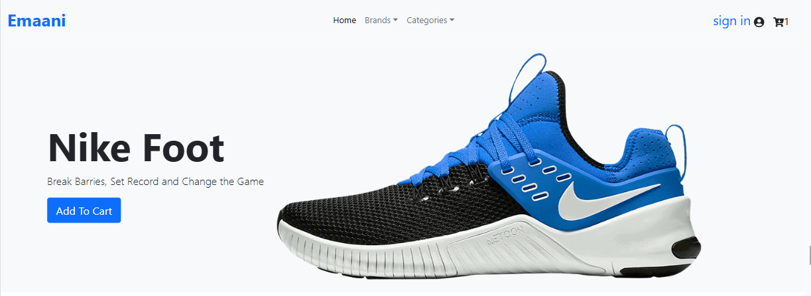
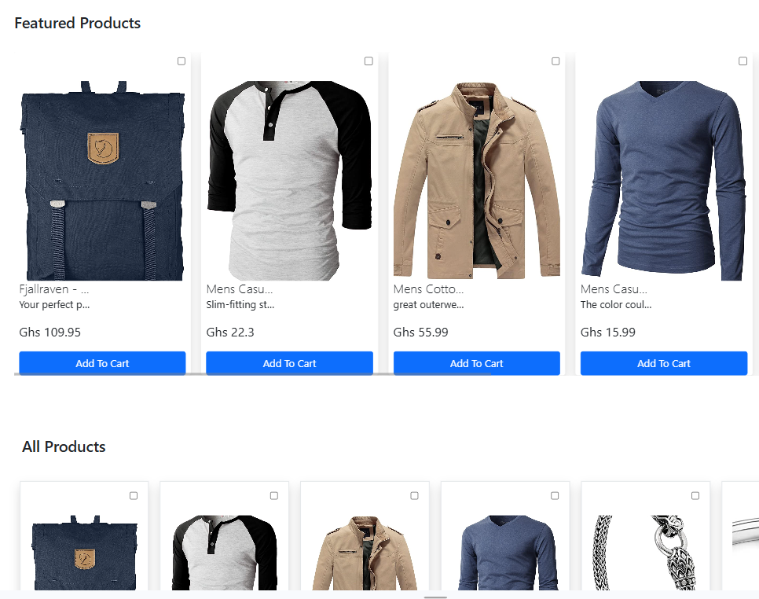
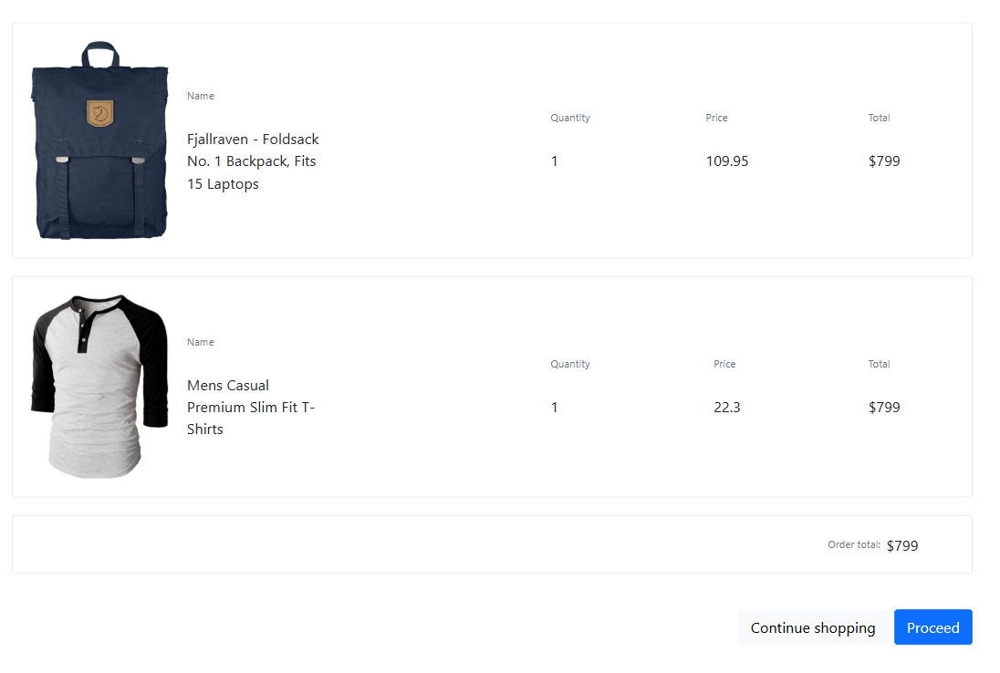

# ECOMMERCE WEBSITE

A simple e-commerce web app built with React and styled using custom css. It fetches product data from FakeStoreAPI and displays them.

## MOTIVE

A simple project intended to help learn how front end websites interact with API's.

## TECH STACK

## FEATURES

1. Products listings
2. checkbox to slect multiple products
3. Add to cart functionality
4. cart button / icon to direct to cart page
5. fetch function to fetch from Fake store API

### SETUP

- Clone Repo
- npm install

  to install dependencies

- npm start

  to run the website

## SCREENSHOTS

- hero
  #

- products listing
  

- cart
  
